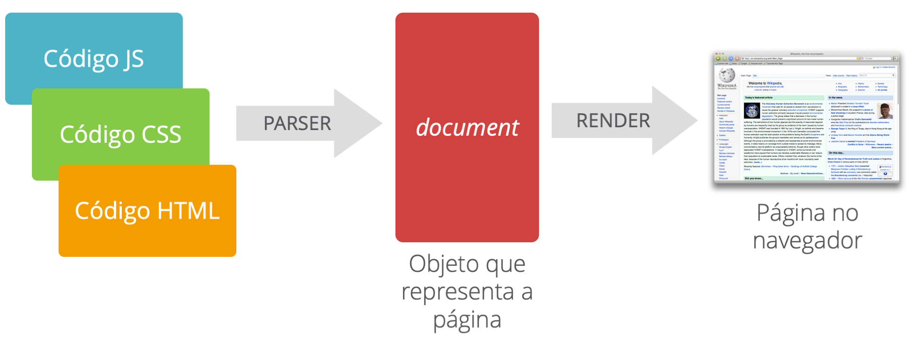
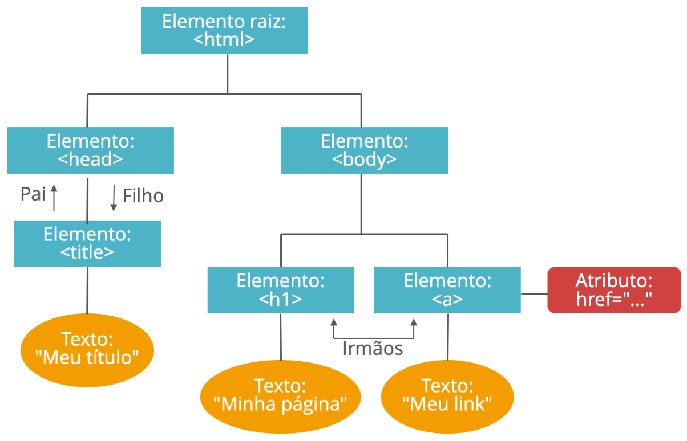
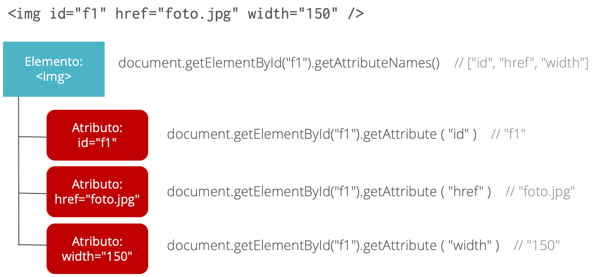
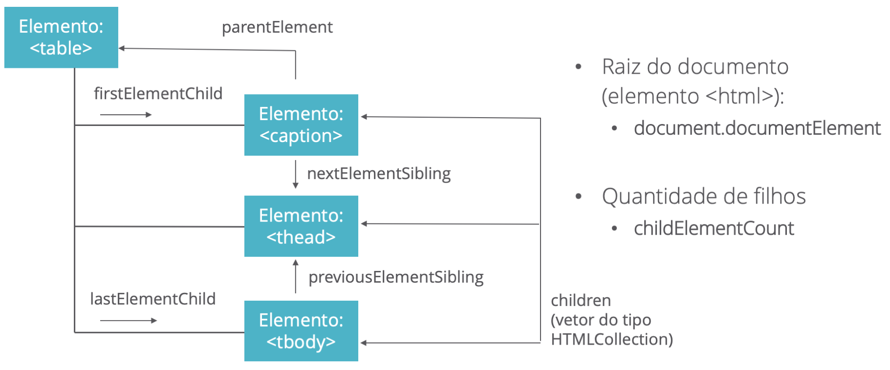

# Document Object Model (DOM)

O *Document Object Model* (DOM) é um objeto JavaScript que representa o documento. Ele é gerado a partir da combinação dos códigos fontes (HTML, CSS e JS), mas é a versão atual da página que está sendo apresentada pelo navegador, como mostra essa figura:



Essa versão pode ser diferente do código fonte, porque ela pode ter sofrido alterações desde a criação da página. Por exemplo, se você tem na sua página um código em JavaScript para identificar o usuário, o seu código fonte terá exatamente isso: um mecanismo para identificar o usuário. Porém, a página pode já ter o seus dados carregados após a sua identificação. Assim, essa versão da página é ligeiramente diferente do código fonte e é ela que é representada pelo objeto `document`. Ainda existe uma terceira versão que é a apresentação da página, para leitura pelo usuário. Assim, o DOM também não é a versão renderizada, mas a estrutura que permite essa renderização.

Na verdade, o termo DOM se refere ao modelo de objetos para representar o documento (que é a página). Esse modelo é deve ser implementado por todos os navegadores e nos oferece três coisas:

* A estrutura da página (incluindo a sua formatação em CSS e o seu comportamento em JS);
* Algumas informações (atributos) sobre a página;
* Algumas operações (métodos) que podem ser realizadas sobre a página.

São muitas e muitas coisas que podemos fazer com a página por meio do DOM - basicamente é assim que a tornamos dinâmica. Nós vamos ver as principais operações, mas se você quiser dar uma olhada no pacote completo, visite a página do [DOM](https://developer.mozilla.org/pt-BR/docs/Web/API/Document_Object_Model) no site MDN. Lá, você encontrará também uma descrição detalhada do que é e de como funciona.

### Usando o DOM

Nós usaremos o DOM para fazermos alterações nas páginas. Essas alterações será resultado da interação com o usuário. Para isso, basta escolhermos que elementos da página queremos alterar e fazermos as alterações propriamente ditas (de conteúdo ou formatação). Para selecionarmos um ou mais elementos, podemos usar os seguintes métodos:

* `document.getElementById( 'id' )` — retorna um único elemento
* `document.getElementsByTagName( 'tag' )` — retorna uma lista de elementos
* `document.querySelector( 'seletor' )` — retorna um único (primeiro) elemento usando a seleção no formato da CSS
* `document.querySelectorAll( 'seletor' )` — retorna uma lista de elementos

Nesses métodos, o termo *id* especifica o conteúdo de um atributo `id` de um elemento qualquer. Como não podemos ter dois elementos com o mesmo `id`, então apenas um elemento será selecionado; o termo tag especifica o nome de um elemento como `p`, `table`, `img`, etc.; e o termo seletor especifica um seletor CSS (da mesma forma que selecionamos elementos para formatação).

Depois de selecionado(s) o(s) elemento(s), podemos alterar o seu conteúdo textual ou o seu conteúdo HTML (caso ele tenha filhos) Este exemplo mostra a alteração de um conteúdo textual por meio da propriedade `innerText`:

```js
let intro = document.querySelector('#introducao');
intro.innerText = 'Nova introdução';
```

E caso o elemento possa ter filhos (outros elementos HTML), devemos usar a propriedade `innerHTML`:

```js
let intro = document.querySelector('#introducao');
intro.innerHTML = 'Nova <strong>introdução</strong>';
```

Para alterarmos a formatação, basta usarmos a propriedade `style` do elemento selecionado. Essa propriedade é um objeto que contém atributos internos para cada aspecto da formatação, usando os mesmos nomes da CSS, mas com a sintaxe *camelCase*:

```js
let intro = document.querySelector('#introducao');
intro.style.textAlign = 'center';
intro.style.fontWeight = 'bold';
intro.style.border = 'thin black solid';
intro.style.padding = '10px 5px';
intro.style.backgroundColor = '#DDF';
```

### A árvore do documento

Internamente, esse objeto documento representa todos os elementos da HTML na forma de uma árvore. Por exemplo, suponha que tenhamos um documento com o seguinte conteúdo:

```html
<html>
    <head>
        <title>Meu título</title>
    </head>
    <body>
        <h1>Minha página</h1>
        <a href="...">Meu link</a>
    </body>
</html>
```

Esse documento, obviamente, tem muitos erros para ser um documento válido. Mas o ponto aqui é apenas representar a sua estrutura na forma de uma árvore, como mostra esta figura:



Se você ainda não conhece uma estrutura de árvore, talvez valha a pena ler sobre as [árvores no Wikipedia](https://pt.wikipedia.org/wiki/Árvore_(estrutura_de_dados)).

Todos os nodos (ou elementos) possuem algumas propriedades. Já vimos as propriedades `innerText`, `innerHTML` e `style`. Podemos também obter os atributos desses nodos por meio do método `getAttributeNames`. Em seguida, podemos obter o valor de cada atributo por meio do método `getAttribute`. Veja esses exemplos:



É bem pouco provável que você venha a trabalhar diretamente com essas propriedades, a não ser em projetos bem sofisticados. No entanto, é importante que você tenha uma visão geral dessa estrutura. Talvez, algo que tenha mais utilidade seja saber como *navegar* pela árvore do documento. Isso significa que você pode recuperar os filhos de um determinado elemento, seus irmãos ou, até mesmo, seu pai. Para isso usamos as seguintes propriedades:

* `document.documentElement` — raiz do documento (elemento `<html>`);
* `parentElement` — nodo pai;
* `firstElementChild` — primeiro filho;
* `lastElementChild` — último filho;
* `nextElementSibling` — próximo irmão;
* `previousElementSibling` — irmão anterior;
* `children` — lista de filhos (como um vetor);
* `childElementCount` — número de filhos.

Esta figura apresenta essas relações:



Novamente, são recursos que provavelmente você usará quando tiver mais experiência com JavaScript.